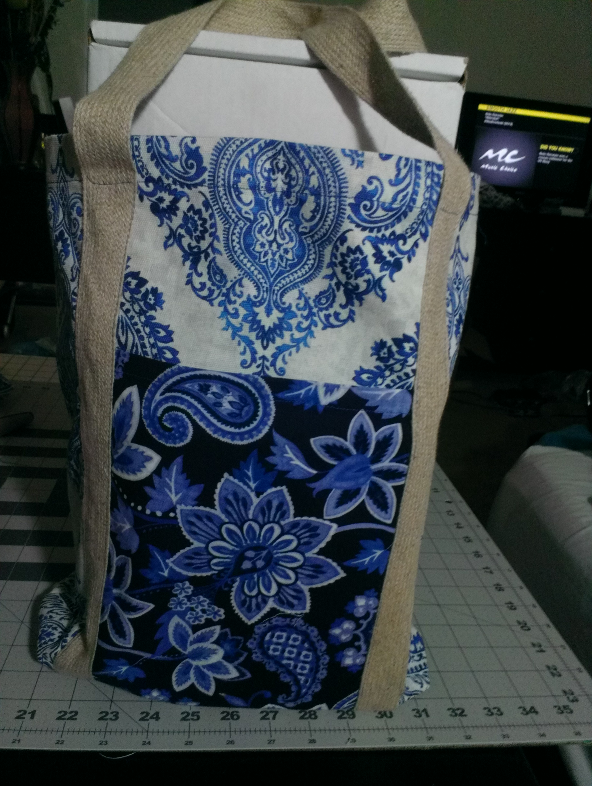

   
 

### Hey there, I am Laura.  Thanks for visiting my GitHub.  I hope you find something useful here.

- 🖥️ I’m currently working on ... **Creating a test engine.**
- 📖 I’m currently learning ...  **How to create projects in MERN**
- 🤝 I’m looking to collaborate on ... **Pretty much anything Web/Software Development-related.  I need the knowledge.**
- 🥺 I’m looking for help with ... **File and image uploads**
- 💬 Ask me about ... **Crafting**
- 📅 2022 Goals: ... **Get a job in Web Development. Improve my GitHub and LinkedIn profiles.  Study more of Java, Python, MERN, and Linux, then contribute more code to GitHub**
- 🗓️ Future Goals: ... ***RedHat Certification***
- 😄 Pronouns: ... ♀️ **She/Her**
- 🤹‍♀️ Fun fact: ... **I am a crafter; love to quilt, sew, play with paper (paper crafting), and upcycle (taking what's old and make it new again)**

-----
### Connect with me:

 

### Technologies: 

            

-----

### Contact Me:
📧 laura.v.bullock@gmail.com

-----
<!-- ### Crafting Goodness:
 

     

----- -->

#### GitHub Stats

<!--#### Profile Visits 

-->

